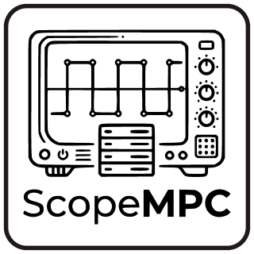

# ScopeMCP — DS1102 Oscilloscope MCP Server

A Python MCP server that connects the [**Owon/Abestop DS1102 (Firmware V3.1.0)**](resources/images/Abestop_DS1102.jpg) oscilloscope (Firmware V3.1.0) to AI assistants like Claude via the [Model Context Protocol](https://modelcontextprotocol.io/).

<p align="center">
  
</p>

---

## Requirements

- Python 3.10+
- libusb backend (on Windows: install via [Zadig](https://zadig.akeo.ie/))
- DS1102 connected via USB

```bash
pip install mcp libusb-package pyusb
```

---

## Setup

Add to `claude_desktop_config.json`:

```json
{
  "mcpServers": {
    "ds1102-scope": {
      "command": "python",
      "args": ["C:/path/to/ds1102_mcp.py"]
    }
  }
}
```

---

## Available Tools

### Status & Metadata

| Tool | Description |
|------|-------------|
| `get_connection_status` | Check if the scope is connected. Returns `connected`, `model`, `run_status`, `timestamp`. |
| `get_live_metadata` | Full device metadata: timebase, sample rate, channel settings, trigger config, run status. |
| `get_measurements` | Frequency, period, scale, probe factor and coupling for both channels. Also exposes `raw_channel_keys` for firmware field diagnostics. |

### Waveform Capture

| Tool | Parameters | Description |
|------|-----------|-------------|
| `capture_waveform` | `channel` (1 or 2), `max_samples` (default 500) | Captures a single channel. Returns raw samples, timestamp, metadata and voltage conversion formula. `original_count` is always 1520 (hardware fixed). |
| `capture_dual_waveform` | `max_samples` (default 400) | Captures both channels in one call. Faster than two separate calls. |

**Voltage conversion formula** (included in every capture response):
```
voltage = (raw - OFFSET) / 250.0 * scale_v * probe_factor
```
Where `OFFSET` and `scale_v` come from the `metadata` field of the response.

> **Note:** The DS1102 always transfers exactly 3044 bytes (1520 samples) over USB regardless of `max_samples`. Downsampling happens in software after the transfer. This is a hardware limitation.

### Vertical (Channel) Control

| Tool | Parameters | Description |
|------|-----------|-------------|
| `set_vertical_scale` | `channel` (1/2), `scale` (e.g. `"1V"`, `"500mV"`) | Sets V/div for a channel. |
| `set_channel_coupling` | `channel` (1/2), `coupling` (`"AC"`, `"DC"`, `"GND"`) | Sets input coupling. |
| `set_voltage_offset` | `channel` (1/2), `offset` (float, Volts) | Shifts the vertical position. |

### Horizontal Control

| Tool | Parameters | Description |
|------|-----------|-------------|
| `set_horizontal_scale` | `scale` (e.g. `"1ms"`, `"500us"`) | Sets the timebase (time/div). |

### Trigger

| Tool | Parameters | Description |
|------|-----------|-------------|
| `set_trigger_mode` | `mode` (`"AUTO"`, `"NORMAL"`, `"SINGLE"`) | Sets trigger sweep mode. |
| `set_trigger_source` | `source` (`"CH1"`, `"CH2"`) | Selects trigger source channel. |
| `set_trigger_slope` | `slope` (`"RISE"`, `"FALL"`) | Sets trigger edge direction. |
| `set_trigger_level` | `level_mv` (float, millivolts) | Sets trigger threshold. e.g. `500.0` = 0.5V. |

### Device Control

| Tool | Parameters | Description |
|------|-----------|-------------|
| `set_run_state` | `state` (`"RUN"`, `"STOP"`) | Starts or stops acquisition. |
| `run_autoset` | — | Runs the scope's automatic setup routine. |

---

## Known Limitations

- **Capture speed (~7–10s):** The DS1102 always transfers the full 1520-sample buffer over USB. The `:DATA:WAVE:POINTS` SCPI command has no effect on transfer size for this firmware. This is a confirmed hardware limitation — see `FINDINGS_USB_Transfer_Limit.md`.
- **`run_status` never shows `STOP`:** The firmware always reports `TRIG` in the status field, even when stopped. This is a firmware behavior, not a server bug.
- **CH2 returns zeros when `DISPLAY: OFF`:** No signal data is available from a channel that is disabled on the scope.

---

## Protocol Notes (Firmware V3.1.0)

- Every SCPI command is prefixed with a **4-byte little-endian length header**.
- Commands must end with `\n` (0x0A).
- Screen data: 1520 samples × 2 bytes signed 16-bit little-endian = 3040 bytes + 4-byte header.
- Full protocol details: see `ds1102_protocol.md`.

---

## License

MIT
